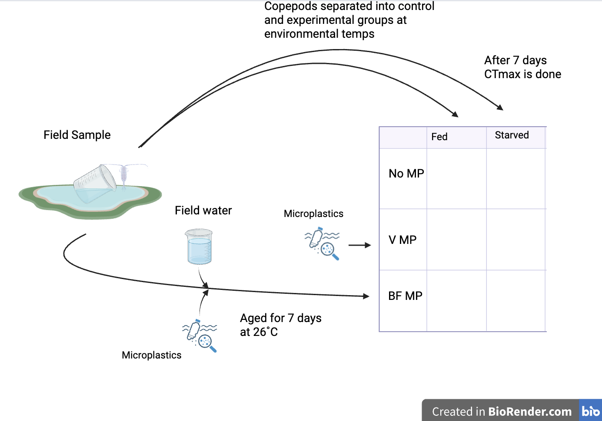

## Thesis Details

|                   |                              |
|------------------:|------------------------------|
|           Mentor: | Dr. Matthew Sasaki           |
| Committee Member: | Dr. Sarah Gignoux-Wolfsohn   |
|   Project Format: | Research Thesis              |
|   Project Output: | Article length written paper |

## Proposal Background

Microplastics are a growing concern in the world today. <!--# Maybe more detail on what microplastics are? Size range, composition, etc. -->The amount of these microplastics has been increasing over the years (REF) <!--#  -->, but not much is known about their long term effects on living organisms. Microplastics have been observed to acquire <!--# change to "microbial biofilms under natural conditions (Ballesté et al. 2024)." -->biofilms of microscopic organisms such as bacteria and algae while in the environment (Ballesté et al., 2024).

Copepods are small zooplankton are some of the most important organisms in the food chain as they consume phytoplankton and they themselves are a very abundant, protein rich food source for animals as small as fish larvae to whales. <!--# Needs a bridge statement to link copepods to microplastics - "Given their important role in foodwebs, how copepods respond to increasing exposure to microplastics will have strong effects on XYZ" or something like that --> Previous studies with marine copepods have shown a potential hormetic <!--# make sure to define this --> curve with their CTmax when consuming a small quantity of microplastics (Zhang et al., 2025) <!--# is this paper in the zotero? Seems interesting and would love to read it, but can't find it-->. Other studies have also pointed out that copepods are able to detect microplastics and avoid them when feeding with a success rate of up to 80% (REF) <!--#  -->, <!--# I condensed these sentences here -->even in the presence of a biofilm (Xu et al., 2022). These dynamics and the effects of biofilms may, however, vary across species (Fagiano et al., 2025 <!--# changed the sentence a bit - does this paper address biofilm effect or just the selective feeding? -->).

<!--# I think a new paragraph here dealing with starvation effects is useful -->

The effect of particle aging and biofilm formation may also depend on the nutritional state of the copepod. Under low-food conditions, the presence of a biofilm may provide some nutritional benefit to grazers (Botterell et al., 2020), thus reducing the selective feeding behaviour and increasing exposure to microplastics.

## Research Questions and Hypotheses

This research project will examine the effects of microplastic exposure on copepod physiology, and test whether these effects are altered by aging in environmental water samples (i.e. promoting the formation of a biofilm). <!--# Moved this sentence here from the end of the last section -->The question being addressed is: Does aging microplastics alter how microplastics affect the physiology of a freshwater copepod? <!--# I think this sentence should be: "We have three primary questions: -->

<!--# For this section, can we organize it as Question and hypothesis? -->

**Question 1:** Does exposure to microplastics affect upper thermal limits in the freshwater copepod *Skistodiaptomus pallidus*?

> *Hypothesis 1*: XYZ

**Question 2:** Does the effect of microplastics on upper thermal limits differ between aged and un-aged microplastics?

> *Hypothesis 2*: XYZ

**Question 3:** Does starvation alter the effects of microplastics on upper thermal limits?

> *Hypothesis 3*: XYZ

## Experimental Design

{width="406"}

### Hypothesis Testing

We will be using a mixed effects model to test our hypotheses. <!--# Moved this sentence to the start of the section --> We are testing three hypotheses.

For our hypothesis that XYZ <!--# state hypothesis here --> we expect to see ABC if the hypothesis is supported <!--# provide evidence for the hypothesis, tied to the mixed effects model in this case -->.



## Project Timeline

| Month | Progress |
|--------------:|---------------------------------------------------------|
| September | Background reading, Planning, 1st experimental replicate |
| October | Experimental replicates, prepare poster on preliminary data |
| November | Final Experimental Replicates, Data analysis |
| December | Data analysis |
| January | Writing thesis |
| February | Writing thesis |
| March | Submit draft thesis to committee member, Prepare poster for student research and community engagement symposium |
| April | Writing thesis, Prepare final presentation for honors program |
| May |  |
